# Plan: Sistema de Informe Producción vs Gastos

## Objetivo

Generar informes mensuales y trimestrales (octubre, noviembre, diciembre 2025) que muestren por máquina: producción, gastos en repuestos, horas hombre, y producción real (trabajo realizado - gastos).

## Arquitectura de la Solución

### Estructura de Archivos

```
src/
├── domain/
│   ├── entities/
│   │   ├── Maquina.py          # Entidad máquina con código normalizado
│   │   ├── Produccion.py       # Entidad producción (MT3, horas, km, vueltas)
│   │   ├── HorasHombre.py      # Entidad horas hombre
│   │   └── Repuesto.py         # Entidad repuesto con costo
│   ├── repositories/
│   │   ├── IProduccionRepository.py
│   │   ├── IHorasHombreRepository.py
│   │   └── IRepuestosRepository.py
│   └── services/
│       ├── NormalizadorMaquinas.py      # Normaliza códigos de máquinas
│       ├── CalculadorProduccion.py      # Calcula producción total (MT3, horas, km, vueltas)
│       ├── CalculadorGastos.py          # Calcula gastos totales (repuestos + HH)
│       ├── CalculadorProduccionReal.py  # Calcula producción real (producción - gastos)
│       └── GeneradorInformes.py         # Genera Excel y HTML
├── infrastructure/
│   ├── csv/
│   │   ├── ProduccionCSVReader.py
│   │   ├── HorasHombreCSVReader.py
│   │   └── RepuestosCSVReader.py
│   └── export/
│       ├── ExcelExporter.py
│       └── HTMLExporter.py
├── application/
│   └── InformeService.py       # Orquestador principal
└── main.py                      # Punto de entrada
```

## Flujo de Procesamiento

```mermaid
flowchart TD
    A[Inicio] --> B[Leer CSV Producción]
    A --> C[Leer CSV Horas Hombre]
    A --> D[Leer CSV Repuestos]
    
    B --> E[Filtrar Oct-Nov-Dic 2025]
    C --> F[Filtrar Oct-Nov-Dic 2025]
    D --> G[Filtrar Oct-Nov-Dic 2025]
    
    E --> H[Normalizar Códigos Máquinas]
    F --> H
    G --> H
    
    H --> I[Agrupar por Máquina y Mes]
    
    I --> J[Calcular Producción Total]
    I --> K[Calcular Horas Hombre]
    I --> L[Calcular Gastos Repuestos]
    
    J --> J1[Agregar MT3, Horas, KM, Vueltas]
    K --> M[Calcular Costo HH = HH × $35.000]
    L --> N[Sumar Total Repuestos]
    
    M --> O[Calcular Gastos Totales]
    N --> O
    
    J1 --> P[Calcular Producción Real]
    O --> P
    P --> P1[Producción Real = Producción - Gastos Totales]
    
    P --> Q[Generar Excel]
    P --> R[Generar HTML]
    
    Q --> S[Fin]
    R --> S
```



## Componentes Principales

### 1. Normalizador de Máquinas (`NormalizadorMaquinas.py`)

- Extrae código de máquina usando regex: `\[?([A-Z]+-\d+[A-Z0-9-]*)\]?`
- Normaliza formatos como:
  - `[CT-10 HKDX21] - FOTON AUMAN 3239 `→ `CT-10 HKDX21`
  - `CT-10 HKDX21 - FOTON - AUMAN 3239` → `CT-10 HKDX21`
  - `CT-10 CAMION FOTON HKDX21` → `CT-10 HKDX21`

### 2. Lectores CSV

- **ProduccionCSVReader**: Lee `Harcha Maquinaria - Reportaría_Reportes_Tabla (3).csv`
  - Parsear fecha formato `dd/mm/yyyy`
  - Extraer: MT3, HORAS_TRABAJADAS, KILOMETROS, VUELTAS
- **HorasHombreCSVReader**: Lee `_Harcha Maquinaria- HH_Copia de MAQVSOTSVSHH_Tabla.csv`
  - Parsear fecha formato `dd MMM yyyy` (ej: "31 dic 2025")
  - Extraer horas hombre
- **RepuestosCSVReader**: Lee `DATABODEGA.csv`
  - Parsear fecha formato `dd-mm-yyyy`
  - Filtrar por "Centro Costo(Salida)" que contenga código de máquina
  - Extraer total de repuestos

### 3. Calculador de Producción (`CalculadorProduccion.py`)

- Agrega producción por máquina/mes:
  - Suma de MT3 (metros cúbicos)
  - Suma de horas trabajadas
  - Suma de kilómetros
  - Suma de vueltas
- Maneja valores "No hay datos" como 0

### 4. Calculador de Gastos (`CalculadorGastos.py`)

- Suma gastos de repuestos por máquina/mes
- Calcula costo HH = horas × $35.000 (costo fijo)
- Total gastos = repuestos + costo HH

### 5. Calculador de Producción Real (`CalculadorProduccionReal.py`)

- Calcula producción real = Producción Total - Gastos Totales
- Por cada unidad de producción (MT3, horas, km, vueltas)
- También calcula valor monetario de producción real

### 6. Generadores de Informes

#### Excel (`ExcelExporter.py`)

- Hoja 1: Resumen Trimestral
  - Columnas: Máquina | Producción Oct (MT3/Horas/KM/Vueltas) | Gastos Oct | Producción Real Oct | ... (Nov, Dic) | Totales
- Hoja 2: Detalle Producción Mensual
  - Desglose de producción (MT3, horas, km, vueltas) por máquina y mes
- Hoja 3: Detalle Gastos Mensual
  - Desglose de gastos (repuestos + HH) por máquina y mes
- Hoja 4: Desglose Repuestos
  - Lista de repuestos por máquina/mes
- Hoja 5: Desglose Horas Hombre
  - Lista de HH por máquina/mes/mecánico

#### HTML (`HTMLExporter.py`)

- Dashboard con gráficos (usando Chart.js)
- Tablas interactivas con filtros
- Resumen ejecutivo
- Detalle por máquina

## Datos de Configuración

- **Costo fijo por hora**: $35.000 CLP (fijo para todos los mecánicos)
- **Meses a procesar**: Octubre, Noviembre, Diciembre 2025
- **Formato de fechas**: Múltiples formatos a normalizar

## Archivos a Procesar

1. `_Harcha Maquinaria- HH_Copia de MAQVSOTSVSHH_Tabla.csv`
2. `DATABODEGA.csv`
3. `Harcha Maquinaria - Reportaría_Reportes_Tabla (3).csv`

## Salidas Generadas

1. `informe_produccion_gastos.xlsx` - Informe completo en Excel
2. `informe_produccion_gastos.html` - Informe interactivo en HTML

## Consideraciones Técnicas

- Manejo de fechas en múltiples formatos
- Normalización de códigos de máquinas (regex)
- Manejo de valores "No hay datos" en CSV
- Agregación de datos por máquina y mes
- Cálculo de producción real = producción - (repuestos + HH × costo)
- Formato de moneda chilena (CLP) en reportes