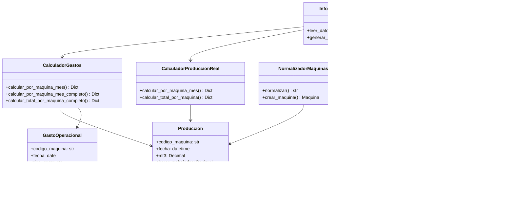

# Análisis Completo del Proyecto - GastosVsProducción

**Fecha:** 23 de enero 2026  
**Cliente:** Harcha Maquinaria SPA  
**Estado:** Sistema Operativo v2.0

---

## 1. Resumen Ejecutivo

El proyecto **GastosVsProducción** es un sistema de análisis financiero desarrollado para Harcha Maquinaria SPA que permite comparar la producción de maquinaria pesada y vehículos con sus gastos operacionales correspondientes. El sistema integra datos de múltiples fuentes (Harcha Maq App, Construit, DATABODEGA, Leasing) para generar informes trimestrales detallados.

### Resultados Q4 2025
- **Total Producción (MT3):** 1,235
- **Total Producción Real:** $591,066,899 CLP
- **Total Gastos Operacionales:** $700,806,451 CLP
- **Resultado Neto:** -$109,739,552 CLP (Pérdida de 18.6%)

---

## 2. Arquitectura del Sistema

### 2.1 Patrón Arquitectónico

El sistema sigue **Arquitectura Limpia (Clean Architecture)** con separación clara de responsabilidades:


### 2.2 Estructura de Directorios

```
GastosVsProduccion/
├── main.py                          # Punto de entrada principal
├── requirements.txt                 # Dependencias Python
├── config_uf.json.example           # Configuración valor UF
├── README.md                        # Documentación principal
├── CONTEXTO_PROYECTO.md            # Contexto del proyecto
├── ESTADO_SISTEMA.md                # Estado actual del sistema
│
├── src/
│   ├── application/                # Capa de aplicación
│   │   └── InformeService.py      # Orquestador principal
│   │
│   ├── domain/                     # Capa de dominio
│   │   ├── entities/               # Entidades de dominio
│   │   │   ├── Produccion.py
│   │   │   ├── HorasHombre.py
│   │   │   ├── Repuesto.py
│   │   │   ├── Leasing.py
│   │   │   ├── GastoOperacional.py
│   │   │   └── Maquina.py
│   │   │
│   │   └── services/               # Servicios de dominio
│   │       ├── CalculadorGastos.py
│   │       ├── CalculadorProduccion.py
│   │       ├── CalculadorProduccionReal.py
│   │       ├── NormalizadorMaquinas.py
│   │       └── ValorUFService.py
│   │
│   └── infrastructure/             # Capa de infraestructura
│       ├── csv/                    # Lectores de CSV
│       │   ├── ProduccionCSVReader.py
│       │   ├── HorasHombreCSVReader.py
│       │   ├── RepuestosCSVReader.py
│       │   ├── LeasingCSVReader.py
│       │   └── ReportesContablesReader.py
│       │
│       └── export/                 # Exportadores
│           ├── ExcelExporter.py
│           └── HTMLExporter.py
│
├── gastos/                         # Archivos de datos
│   ├── Harcha Maquinaria - Reportaría_Reportes_Tabla (3).csv
│   ├── _Harcha Maquinaria- HH_Copia de MAQVSOTSVSHH_Tabla.csv
│   ├── DATABODEGA.csv
│   ├── Leasing Credito HMAQ.csv
│   ├── barredora.csv
│   ├── camiones.csv
│   ├── vehiculos.csv
│   ├── taller.csv
│   └── ... (más archivos de gastos por tipo de máquina)
│
├── analisis_gastos/                # Reportes generados
│   ├── comparativa_produccion.csv
│   ├── reportes_por_maquina.csv
│   ├── reportes_por_cuenta.csv
│   └── ...
│
├── informe_produccion_gastos.xlsx  # Reporte Excel (454 KB)
└── informe_produccion_gastos.html   # Dashboard HTML (288 KB)
```

---

## 3. Componentes del Sistema

### 3.1 Entidades de Dominio

#### Produccion
- **Propósito:** Representa los datos de producción de una máquina
- **Atributos:** código_maquina, fecha, mt3, horas_trabajadas, kilometros, vueltas, precio_unidad, valor_monetario
- **Decorador:** `@dataclass(frozen=True)` - Entidad inmutable

#### GastoOperacional
- **Propósito:** Representa un gasto operacional con clasificación por tipo
- **Enum TipoGasto:** 27 tipos de gastos operacionales (combustibles, repuestos, reparaciones, seguros, etc.)
- **Códigos contables:** Mapeo completo a códigos 401010101-401040104

#### HorasHombre
- **Propósito:** Registro de horas trabajadas por mecánicos
- **Costo fijo:** $35,000 CLP por hora

#### Repuesto
- **Propósito:** Salida de repuestos de bodega (DATABODEGA)
- **Atributos:** nombre, cantidad, precio_unitario, total, asignado_a

#### Leasing
- **Propósito:** Cuotas mensuales de leasing de maquinaria
- **Cálculo:** Aplica cuota mensual para octubre, noviembre, diciembre

### 3.2 Servicios de Dominio

#### CalculadorGastos
- **Responsabilidad:** Calcular gastos agregados por máquina y mes
- **Métodos principales:**
  - `calcular_por_maquina_mes()`: Cálculo básico (repuestos + HH + leasing)
  - `calcular_por_maquina_mes_completo()`: Incluye 27 categorías de gastos
  - `calcular_total_por_maquina_completo()`: Total trimestral por máquina

#### CalculadorProduccionReal
- **Responsabilidad:** Calcular producción real (producción - gastos)
- **Fórmula:** Producción Real = Producción Neta - Gastos Totales

#### NormalizadorMaquinas
- **Responsabilidad:** Normalizar códigos de máquina desde diferentes formatos
- **Patrón regex:** `r'\[?([A-Za-z]+-\d+[A-Za-z0-9-]*)\]?'`
- **Patrones reconocidos:** CT, EX, CF, RX, MN, BD, TC, CP, GM, BA, T, C

### 3.3 Lectores CSV (Infrastructure)

#### ReportesContablesReader
- **Responsabilidad:** Leer todos los archivos CSV de reportes contables (Construit)
- **Archivos procesados:** 16 archivos CSV de la carpeta gastos/
- **Registros procesados:** 5,914 registros en Q4 2025
- **Filtro:** Solo gastos con código 401xxx (gastos operacionales)

#### ProduccionCSVReader
- **Responsabilidad:** Leer producción diaria de Harcha Maq App
- **Registros:** 5,127 registros en Q4 2025
- **Tipos de unidad:** MT3, Horas, Km, Vueltas, Días, UF

#### HorasHombreCSVReader
- **Responsabilidad:** Leer registros de horas hombre
- **Registros:** 630 registros en Q4 2025
- **Costo fijo:** $35,000 CLP por hora

#### RepuestosCSVReader
- **Responsabilidad:** Leer salidas de repuestos de bodega
- **Registros:** 2,915 registros en Q4 2025
- **Total:** $171,189,015 CLP

#### LeasingCSVReader
- **Responsabilidad:** Leer cuotas de leasing
- **Registros:** 26 registros
- **Cálculo:** Aplica cuota mensual para los 3 meses del trimestre

### 3.4 Exportadores

#### ExcelExporter
- **Responsabilidad:** Generar informe Excel con múltiples hojas
- **Métodos:**
  - `exportar()`: Versión básica (5 hojas)
  - `exportar_completo()`: Versión completa (6 hojas)

**Hojas generadas (versión completa):**
1. Resumen Trimestral Completo
2. Detalle Producción Completo
3. Detalle Gastos Completo
4. Desglose Repuestos
5. Desglose Horas Hombre
6. Desglose Gastos por Tipo

#### HTMLExporter
- **Responsabilidad:** Generar dashboard HTML interactivo
- **Librería:** Chart.js para gráficos
- **Características:**
  - Resumen ejecutivo con tarjetas
  - Gráficos interactivos (gastos por categoría, producción por mes)
  - Tablas con filtros por máquina y mes
  - Diseño responsive

---

## 4. Flujo de Datos


---

## 5. Fuentes de Datos

### 5.1 Harcha Maq App
- **Archivo:** `Harcha Maquinaria - Reportaría_Reportes_Tabla (3).csv`
- **Contenido:** Producción diaria reportada por operadores
- **Registros:** 5,127 en Q4 2025
- **Tipos de unidad:** MT3, Horas, Km, Vueltas, Días, UF

### 5.2 Sistema Contable (Construit)
- **Archivos:** 16 archivos CSV por tipo de maquinaria
- **Contenido:** Gastos operacionales e ingresos
- **Registros:** 5,914 en Q4 2025
- **Total gastos Q4 2025:** $700,806,451 CLP
- **Total ingresos Q4 2025:** $1,379,494,912 CLP
- **Resultado neto:** +$678,688,461 CLP (ganancia positiva)

### 5.3 DATABODEGA
- **Archivo:** `DATABODEGA.csv`
- **Contenido:** Salidas de repuestos de bodega
- **Registros:** 2,915 en Q4 2025
- **Total Q4 2025:** $218,904,568 CLP

### 5.4 Leasing
- **Archivo:** `Leasing Credito HMAQ.csv`
- **Contenido:** Cuotas mensuales de leasing
- **Registros:** 26

---

## 6. Tipos de Gastos Clasificados (27)

| Código | Tipo | Descripción |
|--------|------|-------------|
| 401010101 | COMBUSTIBLES | Combustibles |
| 401010102 | REPUESTOS | Repuestos y accesorios |
| 401010103 | REPARACIONES | Reparaciones y mantención |
| 401010104 | EPP | Elementos de protección personal |
| 401010105 | PEAJES | Peajes y transbordador |
| 401010106 | SERVICIO_TRANSPORTE | Servicio transporte |
| 401010107 | REVISION_TECNICA | Revisión técnica |
| 401010108 | REMUNERACIONES | Remuneraciones |
| 401010109 | HONORARIOS | Honorarios |
| 401010112 | ALIMENTACION | Alimentación |
| 401010111 | PASAJES | Pasajes nacionales |
| 401010113 | VARIOS | Varios |
| 401010114 | MANTENCION_VARIOS | Mantención varios |
| 401010115 | SEGUROS | Póliza de seguro |
| 401010116 | PERMISOS | Permiso de circulación |
| 401010117 | REVISION | Revisión técnica |
| 401010118 | OTRO_GASTO_TALLER | Otro gasto taller |
| 401010119 | ALQUILER_MAQUINARIA | Alquiler maquinaria |
| 401020101 | SERVICIOS_EXTERNOS | Servicios externos |
| 401020102 | ELECTRICIDAD | Electricidad |
| 401020103 | AGUA | Agua |
| 401020107 | CORRESPONDENCIA | Correspondencia |
| 401020108 | GASTOS_LEGALES | Gastos legales |
| 401020114 | OTRO_GASTO_OPERACIONAL | Otro gasto operacional |
| 401030102 | MULTAS | Multas instituciones públicas |
| 401030107 | OTROS_GASTOS | Otros gastos |
| 401040101 | SUMINISTROS | Suministros |
| 401040104 | OTROS_SUMINISTROS | Otros suministros |

---

## 7. Desglose de Gastos Q4 2025

| Categoría | Monto (CLP) | % del Total |
|-----------|-------------|--------------|
| Otros Gastos (varios códigos) | $425,577,196 | 60.7% |
| Repuestos (DATABODEGA Q4) | $171,189,015 | 24.4% |
| Remuneraciones | $115,760,826 | 16.5% |
| Reparaciones | $76,376,345 | 10.9% |
| Combustibles | $54,199,919 | 7.7% |
| Seguros | $15,188,006 | 2.2% |
| Permisos | $3,753,386 | 0.5% |
| EPP | $2,573,868 | 0.4% |
| Peajes | $1,929,629 | 0.3% |
| Honorarios | $1,864,035 | 0.3% |
| Alimentación | $1,149,590 | 0.2% |
| Correspondencia | $1,104,192 | 0.2% |
| Multas | $685,719 | 0.1% |
| Pasajes | $563,740 | 0.1% |
| Gastos Legales | $80,000 | 0.0% |
| **TOTAL** | **$700,806,451** | **100%** |

---

## 8. Principios de Diseño Aplicados

### 8.1 SOLID
- **S (Single Responsibility):** Cada clase tiene una única responsabilidad
- **O (Open/Closed):** Sistema abierto para extensión, cerrado para modificación
- **L (Liskov Substitution):** Uso de interfaces y abstracciones
- **I (Interface Segregation):** Interfaces específicas y cohesivas
- **D (Dependency Inversion):** Dependencias de abstracciones, no de implementaciones

### 8.2 Clean Code
- Nombres descriptivos y significativos
- Funciones pequeñas y enfocadas
- Sin duplicación de código (DRY)
- Comentarios explicativos cuando es necesario

### 8.3 Clean Architecture
- Separación clara de capas (Application, Domain, Infrastructure)
- Dependencias hacia adentro (Infrastructure → Domain)
- Lógica de negocio independiente de frameworks

---

## 9. Dependencias del Proyecto

```
openpyxl>=3.1.2    # Generación de archivos Excel
xlrd>=2.0.1        # Lectura de archivos XLS antiguos
pandas>=2.0.0      # Manipulación de datos (no utilizado en código actual)
requests>=2.31.0   # Solicitudes HTTP (para obtener valor UF)
```

---

## 10. Scripts Disponibles

### 10.1 Scripts Principales

| Script | Propósito |
|--------|----------|
| `main.py` | Sistema principal - Genera informes completos |
| `analizar_reportes_contables.py` | Análisis de reportes contables (Construit) |
| `comparar_produccion.py` | Comparativa Harcha App vs Construit |
| `comparar_totales.py` | Verificación de totales |

### 10.2 Scripts de Análisis (históricos)

| Script | Propósito |
|--------|----------|
| `analisis_final_completo.py` | Análisis completo final |
| `analizar_codigos_gastos.py` | Análisis de códigos de gastos |
| `analizar_databodega.py` | Análisis de DATABODEGA |
| `analizar_excel_completo.py` | Análisis de Excel completo |
| `analizar_gastos_operacionales.py` | Análisis de gastos operacionales |
| `analizar_repuestos_leidos.py` | Análisis de repuestos leídos |
| `analizar_tipos_gastos.py` | Análisis de tipos de gastos |
| `verificar_integridad.py` | Verificación de integridad de datos |

---

## 11. Observaciones y Hallazgos

### 11.1 Aspectos Positivos

1. **Arquitectura sólida:** Implementación de Clean Architecture con separación clara de capas
2. **Código limpio:** Aplicación de principios SOLID y Clean Code
3. **Normalización robusta:** Sistema de normalización de códigos de máquina flexible
4. **Integración completa:** Múltiples fuentes de datos integradas correctamente
5. **Exportación versatile:** Generación de informes en Excel y HTML con visualización interactiva
6. **Documentación:** Buena documentación en README, CONTEXTO_PROYECTO y ESTADO_SISTEMA

### 11.2 Áreas de Mejora Identificadas

1. **Discrepancia de ingresos vs producción:**
   - Ingresos del sistema contable: $1,379M
   - Producción del sistema: $591M
   - Diferencia: $788M sin explicación clara

2. **Resultado negativo del sistema:**
   - El sistema muestra pérdida de -$109.7M para Q4 2025
   - El sistema contable muestra ganancia de +$678.7M
   - Posible problema en el cálculo o en la integración de datos

3. **Falta de pruebas unitarias:**
   - No hay tests implementados
   - La documentación menciona TDD como metodología pero no está aplicado

4. **Hardcoding de valores:**
   - Costo hora hombre: $35,000 CLP (hardcoded en CalculadorGastos.py)
   - Meses de filtro: [10, 11, 12] (hardcoded en varios archivos)
   - Año de filtro: 2025 (hardcoded)

5. **Normalización pendiente:**
   - Centros de costo sin código estándar (PLANTA CHANCADORA, etc.)
   - Posibles duplicidades de códigos de máquina

6. **Scripts históricos:**
   - Múltiples scripts de análisis que podrían estar obsoletos
   - Falta de organización clara entre scripts activos y obsoletos

---

## 12. Recomendaciones

### 12.1 Prioridad Alta

1. **Investigar discrepancia de ingresos vs producción:**
   - Analizar por qué los ingresos del sistema contable ($1,379M) son mucho mayores que la producción ($591M)
   - Verificar si hay ingresos no relacionados con producción directa

2. **Resolver resultado negativo del sistema:**
   - Revisar el cálculo de producción real
   - Verificar si todos los gastos están siendo contabilizados correctamente
   - Comparar con el resultado positivo del sistema contable

3. **Implementar pruebas unitarias:**
   - Crear tests para los servicios de dominio
   - Implementar tests para los lectores CSV
   - Establecer cobertura mínima de código (80%+)

### 12.2 Prioridad Media

1. **Parametrizar valores hardcoded:**
   - Mover costo hora hombre a archivo de configuración
   - Hacer configurable el período de análisis (meses y año)
   - Crear archivo config.json para todos los parámetros

2. **Mejorar normalización de códigos:**
   - Crear archivo de configuración para códigos especiales
   - Implementar sistema de mapeo flexible para centros de costo pendientes
   - Verificar y eliminar duplicidades de códigos

3. **Agregar métricas de rentabilidad:**
   - Calcular margen por máquina (ganancia/pérdida %)
   - Agregar ranking de máquinas más/menos rentables
   - Calcular costo por MT3 producido

### 12.3 Prioridad Baja

1. **Organizar scripts:**
   - Crear carpeta `scripts/` para scripts de análisis
   - Documentar cuáles scripts están activos y cuáles obsoletos
   - Considerar eliminar scripts que ya no se usan

2. **Mejoras de UI/UX:**
   - Agregar gráfico de tendencia por mes (Oct-Nov-Dic)
   - Agregar filtros por tipo de máquina (camiones, excavadoras, etc.)
   - Exportar reporte en PDF (opcional)

3. **Optimización de rendimiento:**
   - Considerar usar pandas para procesamiento de datos grandes
   - Implementar caché para cálculos repetidos
   - Optimizar generación de informes para grandes volúmenes de datos

---

## 13. Diagrama de Clases Simplificado



---

## 14. Conclusión

El proyecto **GastosVsProducción** es un sistema bien estructurado que implementa correctamente los principios de Clean Architecture y Clean Code. El sistema integra múltiples fuentes de datos y genera informes detallados en Excel y HTML.

Sin embargo, existen **dos problemas críticos** que requieren atención inmediata:

1. **Discrepancia significativa** entre los ingresos del sistema contable ($1,379M) y la producción del sistema ($591M)
2. **Resultado negativo** del sistema (-$109.7M) que contradice el resultado positivo del sistema contable (+$678.7M)

Estos problemas sugieren que puede haber errores en el cálculo de producción real o en la integración de datos. Se recomienda investigar y resolver estos problemas antes de implementar mejoras adicionales.

El sistema tiene una base sólida para expandirse con nuevas funcionalidades como análisis de rentabilidad por máquina, cálculo de costo por MT3, y generación de reportes PDF.

---

**Fin del Análisis Completo del Proyecto**
